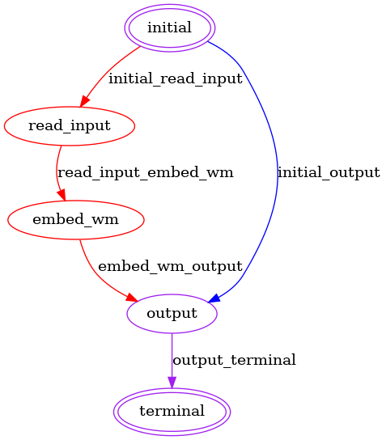

## FeatureCloud NN Watermarking App

This app embeds a watermark into a given NN model. 

### Client's data 

The app is designed for single-client usage. 
A client's data folder should contain two files:
- config.yml 
- model.pth (the name could be different but should coincide with the 'model_name' given in config.yml)

### Config file 
In the config file the following information should be provided:

#### Model Parameters
  - **model_name** (default *'model.pth'*)  
  The name of the file in the client's data folder that contains a model.

- **architecture** (default *'resnet34'*)  
  The architecture of the model. Models from *timm* package are supported. The given name should be the same as the one used in *timm* for that architecture type.

- **turn_off_batch_norm** (defaul *false*)
  Turns off batch normalization during watermark embedding. Learnable parameters are not updated.

#### Watermarking Parameters
- **wm_type** (default *'ood_abstract'*)  
  The watermark embedding method. Currently, three methods are supported:
   - *'ood_abstract'*  
   Implements an approach described in the paper [Turning Your Weakness Into a Strength: Watermarking Deep Neural Networks by Backdooring](https://www.usenix.org/system/files/conference/usenixsecurity18/sec18-adi.pdf). The dataset used for watermarking can be found [here](datasets/abstract). The number of trigger images (see below) should not exceed 100. If you want to use method, please make sure that you copied the '*dataset*' folder into you client's data folder.
   - *'ood_torchvision'*  
  Implements an approach described in the paper [Protecting Intellectual Property of Deep Neural Networks with Watermarking](https://www.doi.org/10.1145/3196494.3196550). In the paper, only MNIST and CIFAR10 were considered as trigger datasets. This app supports the following *torchvision* datasets:
  ```
      'caltech101': torchvision.datasets.Caltech101,
      'cifar10': torchvision.datasets.CIFAR10,
      'cifar100': torchvision.datasets.CIFAR100,
      'fmnist': torchvision.datasets.FashionMNIST,
      'kmnist': torchvision.datasets.KMNIST,
      'lfw': torchvision.datasets.LFWPeople,
      'mnist': torchvision.datasets.MNIST,
      'omniglot': torchvision.datasets.Omniglot,
      'qmnist': torchvision.datasets.QMNIST,
      'semeion': torchvision.datasets.SEMEION,
      'svhn': torchvision.datasets.SVHN,
      'usps': torchvision.datasets.USPS.
  ```
  Please note that in order to use these datasets you should download them before using the app and save corresponding files in your client's data folder under the following path '*datasets/dataset_name/*'. The *dataset_name* here should correspond to one of the names listed above.
   - *'custom'*  
  Trains a model on a custom trigger set. For this method, additional hyperparameters should be provided (see below).
- **wm_classes** (default *[0]*)  
  Labels from the original dataset used to label the trigger set. The amount of samples is equally distributed among classes. 
- **wm_th** (default *80*)  
  The threshold for watermark verification. A watermark is considered successfully embedded if the accuracy of the model on the trigger set is greater or equal to *wm_th*. As soon as the threshold is reached, the training is stopped.
- **batch_size** (default *32*)  
  The batch size used for training a model on a trigger set.
- **optimizer** (default *'sgd'*)   
  The optimizer used for training a model on a trigger set. Supported values: 
  - 'adam'  
  - 'sgd'  
- **lr** (default *0.001*)  
  The learning rate used for training a model on a trigger set.
- **momentum** (default *0.9*)  
  If the optimizer is *'sgd'* and *momentum* is non-zero, SGD with momentum is used.
- **max_epochs** (default *100*)  
  The maximum number of epochs for training on the trigger set. The training is stopped even if the model did not reach the desired performance on the trigger set.
  
#### Trigges Set Parameters
- **dataset_name** (default *null*)  
The dataset from *torchvision* used as a trigger set. This parameters is required if *wm_type* is *'ood_torchvision'*.
- **dataset_folder** (default *null*)  
The name of a folder that contains the trigger set. This parameters is required if *wm_type* is *'custom'*.
- **data_extensions** (default *null*)  
The list of possible extensions of images in the custom trigger set.
- **trigger_set_size** (default *100*)  
The size of the trigger set.
- **image_size** 
  - **height** (default *224*)  
  - **width** (default *224*)  
The size of input images (should correspond to the model architecture).
- **num_channels** (default *3*)  
The number of input channels (should correspond to the model architecture).
Currently, 3-channel and 1-channel datasets are supported. 
- **num_classes** (default *10*)  
The number of classes (should correspond to the model architecture).
- **mean** (default *null*)  
The mean value for data normalization.
- **std** (default *null*)  
The std value for data normalization.

### Output data

The app outputs four items:
- *'wm_model.pth'* - watermarked model.
- *'images'* - a folder with trigger set saved as images.
- *'tensors'* - a folder with trigger set saved as tensors.
- *'labels.csv'* - labels for the trigger set.

### States
The app constits of four states (initial, input reading, watermark embedding, and terminal). The app state diagram is showed below:


### Test run

For a test run, copy the content of the '*test*' folder and move the '*datasets*' folder to your client's data folder. The structure should be the following:
```bash
client_0
├── config.yml
├── model.pth
└── datasets
     └── abstract
         ├── 1.jpg
         ├──...
         └── 100.jpg

```
Running the app with this configuration will embed a watermark into a model ('*model.pth*') with *ood_abstract* method using 20 trigger images. 